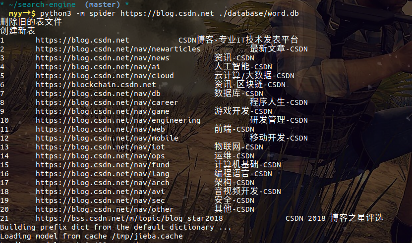
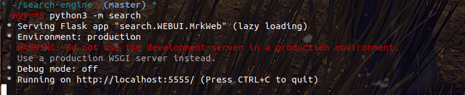
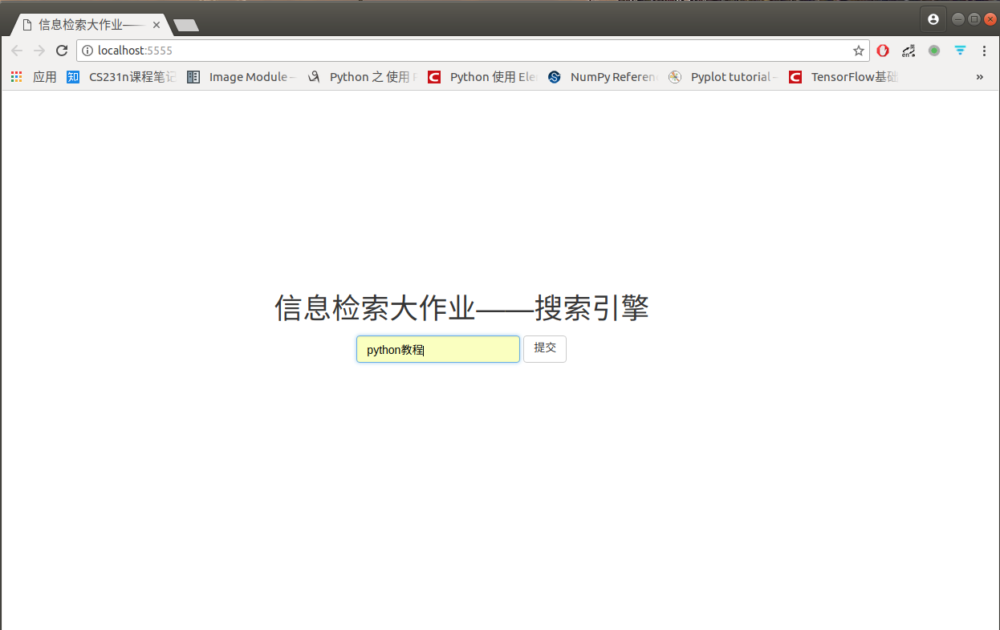
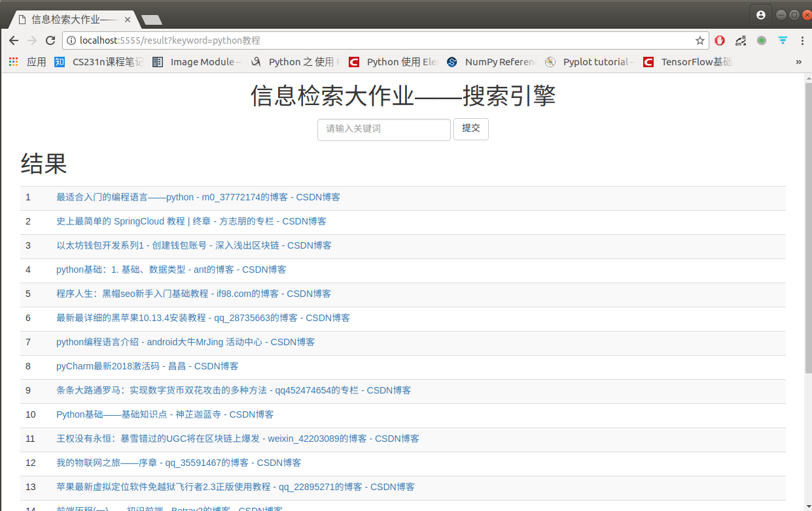

# search-engine
信息检索与文本挖掘大作业1----搜索引擎  
[参考此blog](https://blog.csdn.net/ryinlovec/article/details/53547233)

## 用法  
### 安装环境  
`pip install -r ./requirements.txt`
### 启动爬虫
`python3 -m spider url word_database`
> 其中  
> url	为要爬取的网站，例如 https://blog.csdn.net  
> word_database		为保存词表数据库路径，例如 : ./database/word.db  



### 启动搜索服务
`python3 -m search`
之后用浏览器打开`http://localhost:5555`在搜索框中输入需要搜索的关键字    

  

  

  


## 搜索引擎的组成
搜索引擎主要由三部分组成：网络爬虫，信息整理，查询系统  
其中，网络爬虫主要负责从Internet上搜索下载网页；信息整理系统负责，解析网页，提取URL并将存储解析结果，建立索引；查询系统重要完成解析用户提交的查询请求，并从信息库中搜索相关相信，并将搜索到的网页排序，最终返回给用户。

## 网络爬虫  

网络爬虫主要使用requests包完成  [参考](http://docs.python-requests.org/zh_CN/latest/user/quickstart.html)  

```python
import  requests
r = requests.get('https://blog.csdn.net')
r.text # 存储网页内容
r.encoding　#存储网页编码方式
```

## 建立索引

采用BeautifulSoup进行网页内容解析  
采用jieba进行分词
采用sqlite3数据库存储词表 

### BeautifulSoup解析网页内容  

[参考](https://www.crummy.com/software/BeautifulSoup/bs4/doc/index.zh.html) [或者](https://cuiqingcai.com/1319.html)  

### jieba分词

[参考](https://github.com/fxsjy/jieba)

安装：可以用pip安装也可以下载源码包，解压后执行`python3 setup.py install`安装  

```python
import jieba
seg_list = jieba.cut_for_search(text)
print(' '.join(seg_list))
```

### SQLite3数据库使用  
1. 在ubuntu中安装sqlite3数据库
```shell
sudo apt install sqlite3 #安装sqlite3
sudo apt install libsqlite3-dev #安装sqlite3开发工具库
sudo apt install python-pysqlite2 # 安装python支持
```

2. sqlite3数据库简单使用  
sqlite2数据库以文件形式存在，使用`sqlite3 databasename`就能创建一个sqlite3数据库，删除此文件就是删除数据库。例如 `sqlite3 word.db` 就创建了一个word的数据库，并进入数据库命令行。sqlite3的命令都以`.`开头,SQL语句除外    
常用的命令如下表  

|命令|作用|  
|-----|-----|
|.database|查看数据库|  
|.table或者.tables tablename|查看数据表|  
|inser into tablename value('v1', v2)|向数据表中插入数据|  
|select * from tablename| 查看表中的所有记录|  
|drop tablename|删除数据表|  
|.schema tablename|查看数据包创建语句|  
|.exit| 退出数据库|  

更多用法请参考sqlite3手册 或者 [教程](https://blog.csdn.net/ALDRIDGE1/article/details/17025529)  [或者](http://www.runoob.com/sqlite/sqlite-tutorial.html)  
此外sqlite3可以使用sqlitebrowser图形化访问数据库。  


3. 使用python访问sqlite3数据库  

```python3
import sqlite3

# 建立一个到数据库的链接
conn = sqlite3.connect('./databases/test.db')
# 获取一个操作句柄  
c = conn.cursor()

# 删除一张表
c.execute('drop table student')

# 创建一张表
c.execute('create table student (name varchar(10), age int)')

# 往表中插入一条数据
c.execute('insert into student values(?, ?)', ("hello", 22))

# 查询表中所有数据 
c.execute('select * from student')

result=c.fetchall()

print(result)

conn.close()
```


## 查询系统

网页排序算法使用了 [tf-idf算法](http://www.ruanyifeng.com/blog/2013/03/tf-idf.html)  
